# Adventure Works Sales Analysis

## Introduction
This is an MS Excel Project on Sales Analysis for the Adventure Works business. The project aims to analyse and derive insights to answer crucial questions and help the business make data-driven decisions.

**_Disclaimer_**: _All datasets and reports do not represent any company, institution or country but are provided by Turing College as a graded task to demonstrate the capabilities of MS Excel._

## Problem Statement (ASK)
1. 1. What is the monthly sales trend over the past period?
2. 2. What is the breakdown of online vs. non-online orders?
3. 3. How does delivery performance vary over time (OrderDate vs. ShipDate)?
4. 4. Who are the top salespersons by total sales and volume?
5. 5. Which countries have the highest sales?
6. 6. What are the top reasons for sales?

## Skills/Concepts demonstrated
The following Excel features were incorporated
1.   Pivot Tables
2.   Conditional Formatting
3.   Xlookup, Unique
4.   Charts (lines, bar charts, Pie)

## Data Required (Preparation)
1. Monthly Sales Trend
   - _OrderDate, TotalDue from A.SalesOrderHeader_
2. Online vs. Non-Online Orders
   - _OnlineOrderFlag, TotalDue from A.SalesOrderHeader4. Delivery Performance_
3. Delivery Performance:
   - _OrderDate, ShipDate from A.SalesOrderHeader_
4. Top Salesperson
   - - _SalesPersonID, TotalDue from A.SalesOrderHeader_
   - - _EmployeeID, FullName from A.Employee_
5. Top Countries per sales
   - _TerritoryID from A.SalesOrderHeader_
   - _TerritoryID, CountryRegionCode from A.SalesTerritory_
6. Top Sales Reasons
   - _SalesReasonID from A.SalesOrderHeader_
   - _SalesReasonID, Name from A.SalesReason_

## Process
Data Storage and Cleaning:
- Converted data ranges in each sheet into tables
- Ensured data are correct. E.g. Dates are in date format, and numeric values are in number format
- Duplicate entries and missing data were removed, and NA replaced them where necessary.
- Pivot Tables were created in a new worksheet, 'Tasks -  Pivot Tables'.
- Charts were created in a new worksheet called 'Overview'.

## Analysis
- The Business  has a total of 31.5K Sales orders.
- The Business  has a total sales of 140.7M from July 2001 to JULY 2004
- The Business currently has 17 Salespersons and operates in 6 countries.

## Monthly Sales Trend
- The best sales Year was 2003 with 54.3M, with August and September 2003 recording the most sales.
- July 2004 is an outlier with the lowest sales of 56.2K.

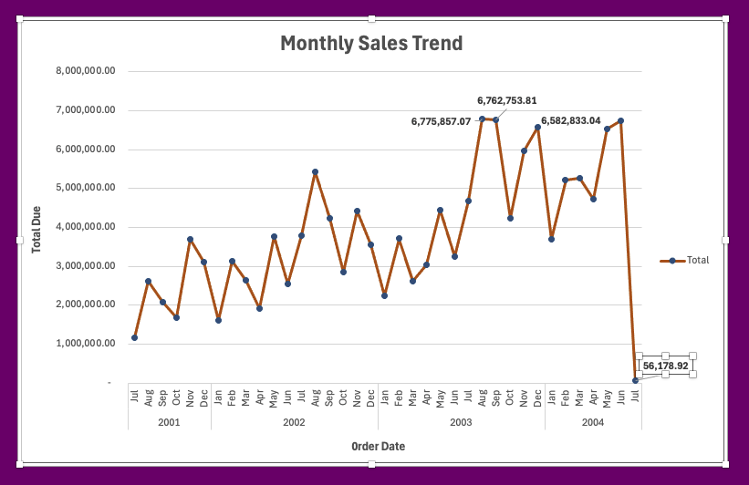
------------------------------------------------------------------------------------------------------------------------

## Yearly Sales Trend
Pivot Table                |               Chart
:-------------------------:|:----------------------:
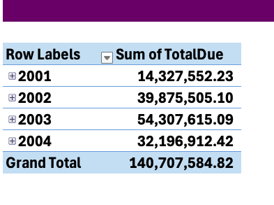               |    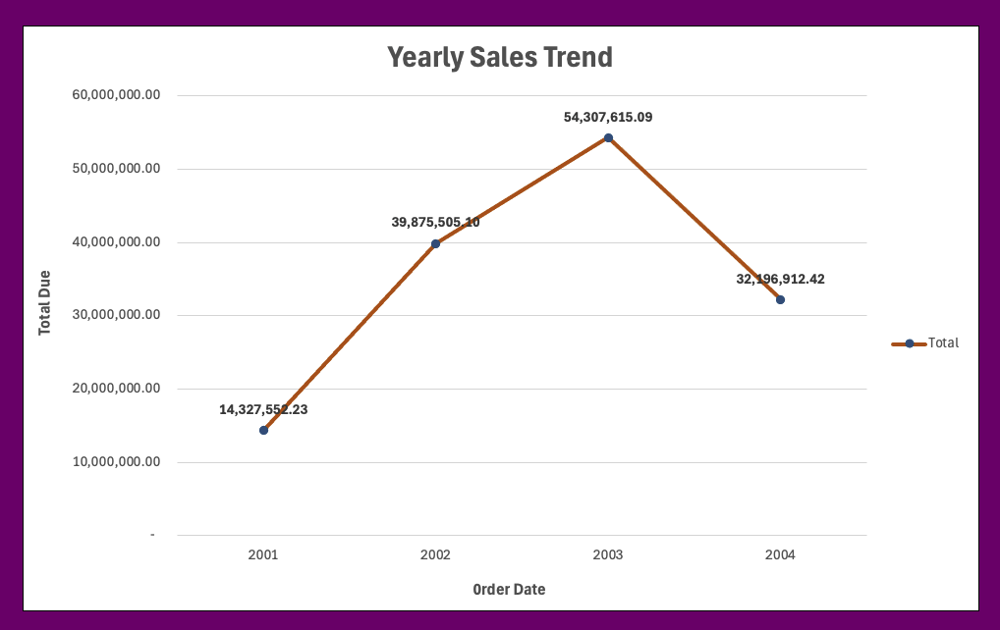
------------------------------------------------------------------------------------------------------------------------

## Online vs. Non-online orders?
- Online sales was 27.7K out of 31.5K orders.
- This represents 88% of the orders.
- Non-online sales was 13.8K, representing 12%.

Pivot Table                |               Chart
:-------------------------:|:----------------------:
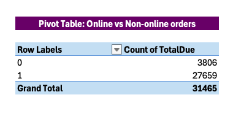               |    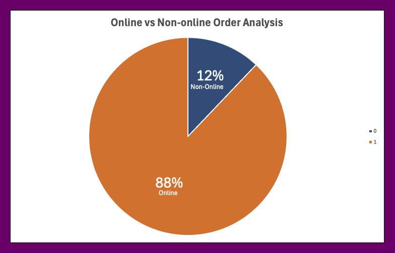
------------------------------------------------------------------------------------------------------------------------

## Delivery performance vary over time (OrderDate vs. ShipDate)
- The delivery performance remained the same from 2001 to 2004.
- The average number of days for delivery was 7 days.

Pivot Table                |               Chart
:-------------------------:|:----------------------:
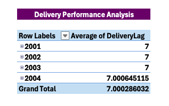               |    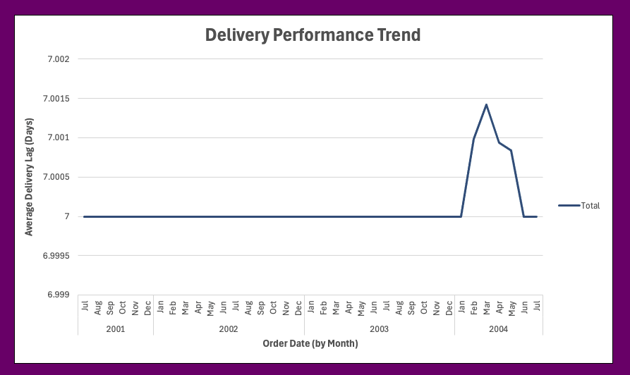
------------------------------------------------------------------------------------------------------------------------

## Top salespersons by total sales and volume
- Taking away online orders, **Linda Mitchell** made the most sales with 13.98M with 418 sales orders.

Pivot Table                |               Chart
:-------------------------:|:----------------------:
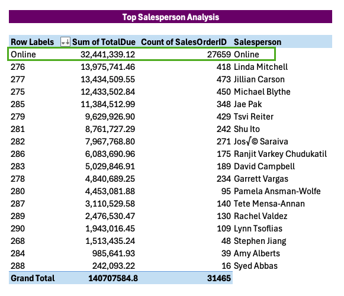               |    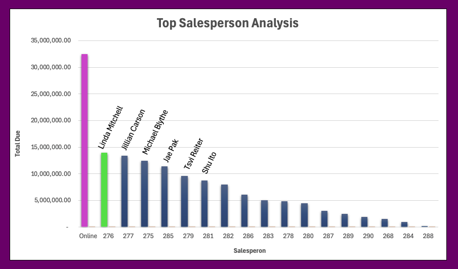
------------------------------------------------------------------------------------------------------------------------

## Which countries have the highest sales?
- The US has the highest sales, with 82.4M, representing 59% of the total sales.

Pivot Table                |               Chart
:-------------------------:|:----------------------:
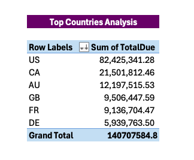               |    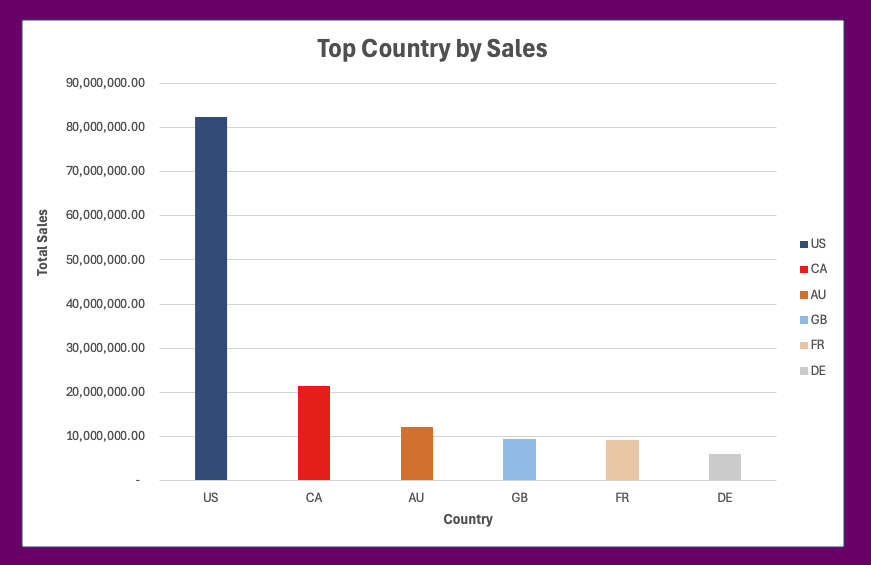
------------------------------------------------------------------------------------------------------------------------

## What are the top reasons for sales?
- The data shows the PRICE of the products was the main reason for customers' purchases.
- However, 27% of customers didn't give a reason to purchase.

Pivot Table                |               Chart
:-------------------------:|:----------------------:
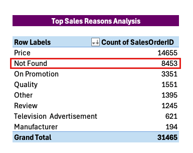               |    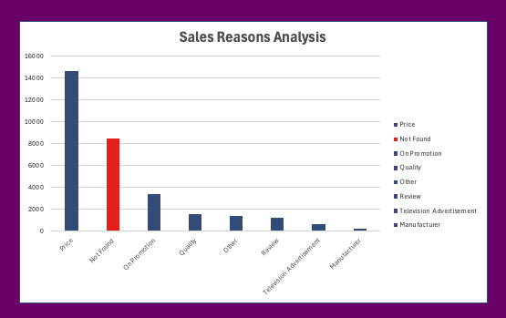
------------------------------------------------------------------------------------------------------------------------

## Dashboard
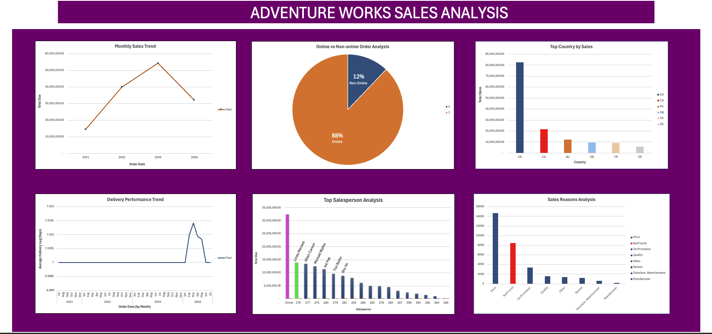  
------------------------------------------------------------------------------------------------------------------------

## Conclusions 
- **Business Decisions:**
  - Given the significant proportion of online sales, invest more in online marketing and e-commerce platforms.
  - Improve the online shopping experience, including website usability, mobile app performance, and customer support.
  - Develop targeted marketing campaigns to increase non-online sales, such as in-store promotions and local advertising.
  - Ensure the current delivery performance standard is maintained and explore further opportunities to reduce delivery times.
  - Continue to focus on the US market by considering expanding product lines and enhancing marketing efforts.
  - Develop specific strategies for increasing market share in Canada, Australia, Britain, France, and Germany.
  - Most customers purchase because of the price. To attract price-sensitive customers, the company should continue to focus on competitive pricing strategies like price matching and discount programs.
 
## Recommendations
For a deep dive into the analytics, the January-June 2001 and August-December 2004 datasets will be required for comparison and data-driven decision-making.
